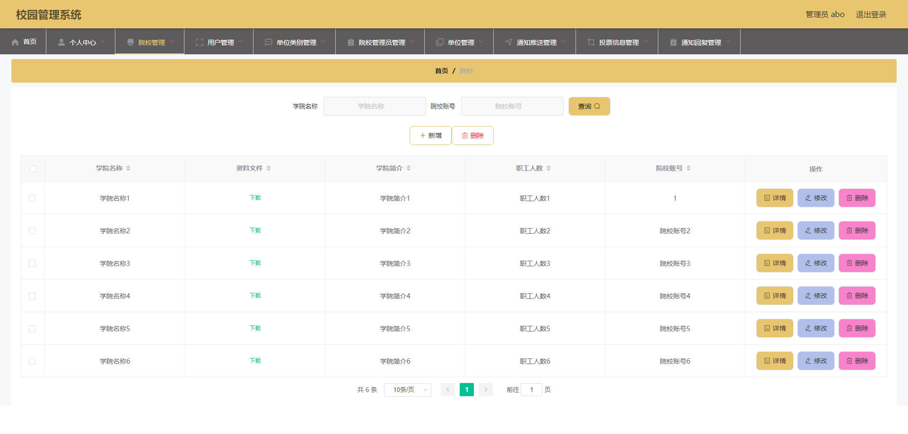
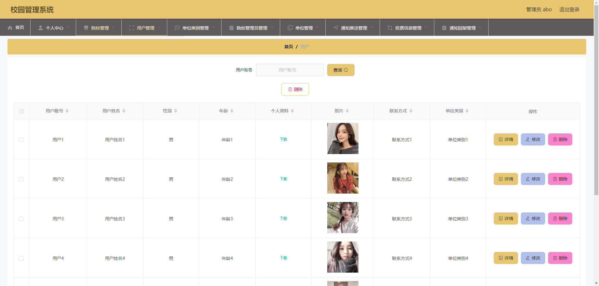
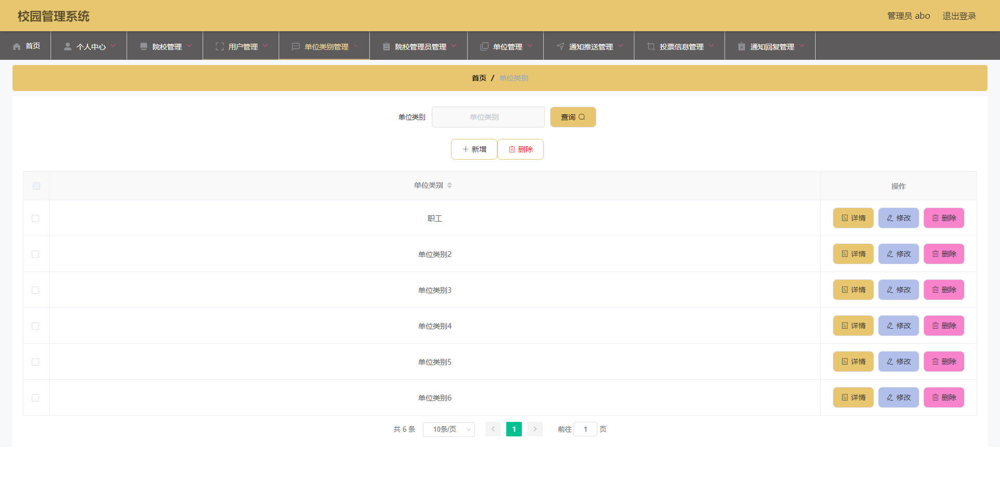
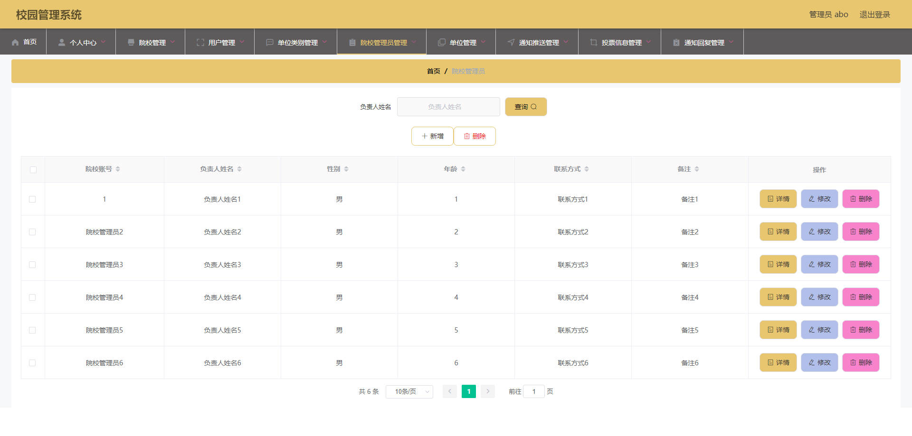
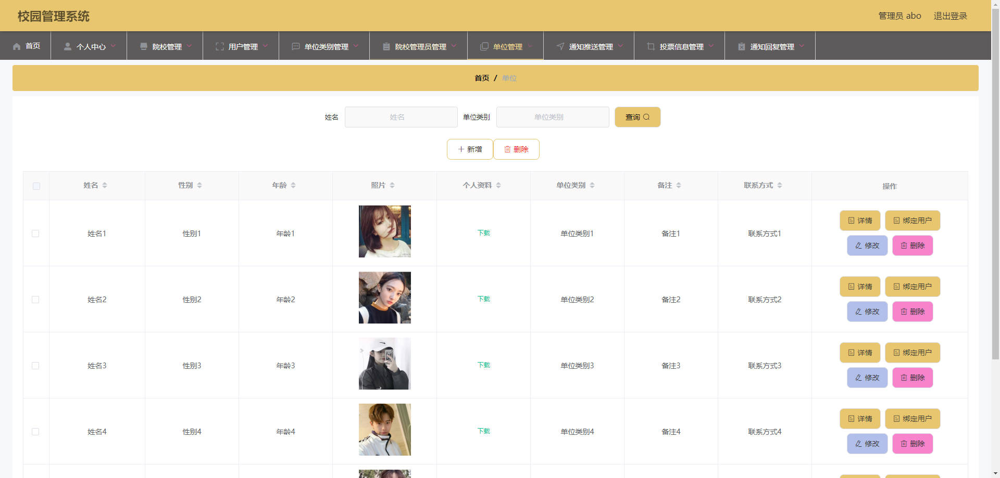
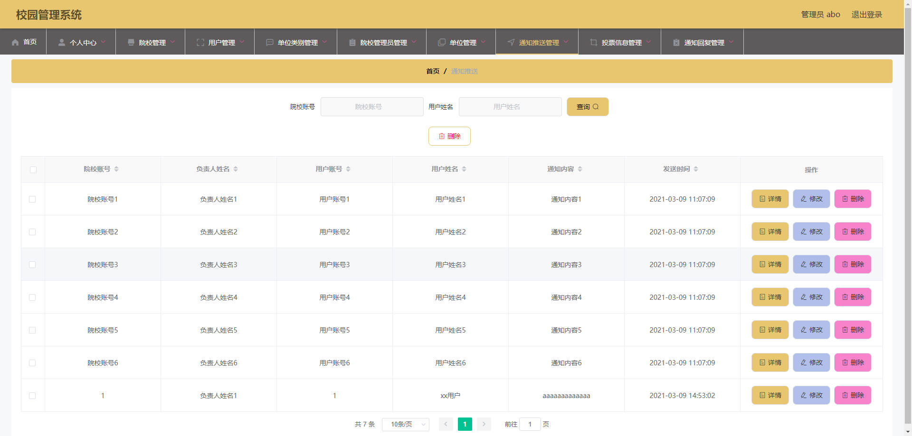
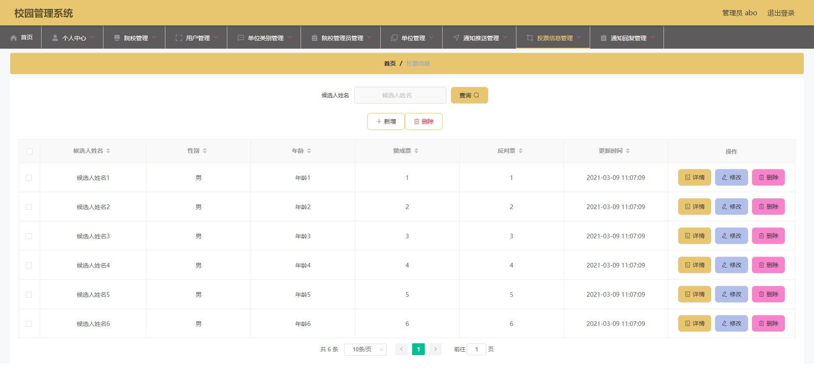
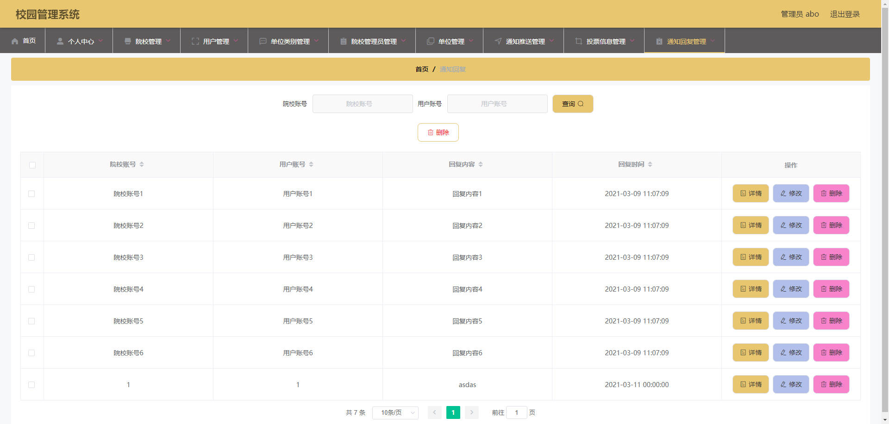
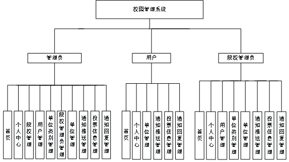
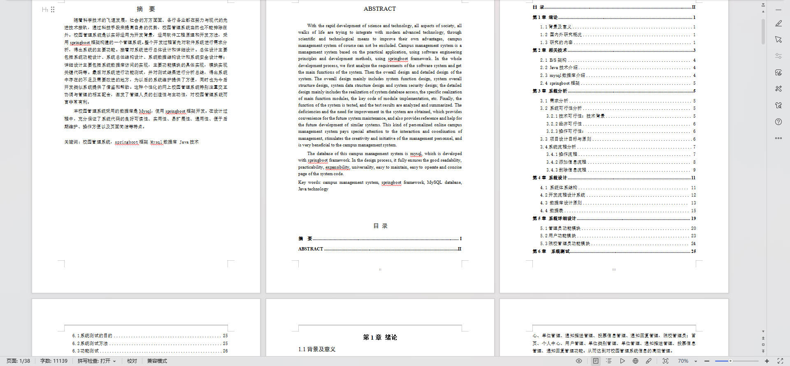

# 基于Springboot的校园管理系统

## Springboot-0014


## 技术栈

Springboot mybatisplus vue mysql maven


## 数据库表(11张)


## 功能介绍

```properties
首页、个人中心、院校管理、用户管理、单位类别管理、院校管理员管理、单位管理、通知推送管理、投票信息管理、通知回复管理，用户；首页、个人中心、单位管理、通知推送管理、投票信息管理、通知回复管理，院校管理员；首页、个人中心、用户管理、单位类别管理、单位管理、通知推送管理、投票信息管理、通知回复管理功能。
```


## 图片

### 前台

### 后台










## 访问路径

### 前台

```properties

```

### 后台

```properties
http://localhost:8080/springboot6yjn8/admin/dist/index.html#/login

账号 abo
密码 abo
```


## 功能图




## 文档目录




## 打赏或交流


